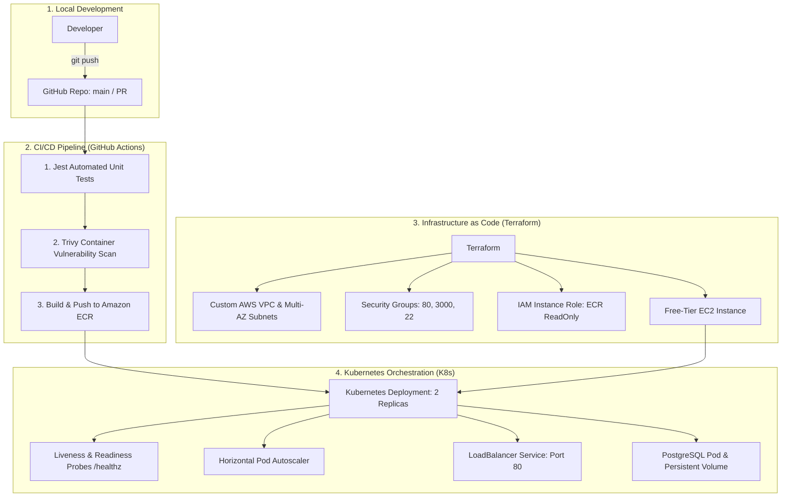

# 🚀 Cloud-Native DevOps & CI/CD Infrastructure Pipeline

[](https://github.com/soumen888/cloud-devops-pipeline/actions)
[](./app/Dockerfile)
[](./k8s)
[](./terraform)
[](https://aws.amazon.com/ecr/)
[](https://github.com/aquasecurity/trivy)

Production-grade, end-to-end DevOps project demonstrating modern cloud-native practices: containerization, automated CI/CD with security scanning, Infrastructure as Code (IaC) with Terraform, and Kubernetes container orchestration.

---

## 🏛️ Architecture Overview



---

## 🛠️ Tech Stack & Tooling

| Category | Technology | Usage in Project |
|---|---|---|
| **Application** | Node.js (Express), PostgreSQL | Microservice with `/healthz`, `/metrics`, `/api/tasks` |
| **Containerization** | Docker, Docker Compose | Multi-stage build (`node:20-alpine`), non-root user `node` |
| **CI/CD** | GitHub Actions | Automated lint, test, Trivy CVE scan, Amazon ECR publishing |
| **Container Registry**| Amazon ECR | Secure private AWS container image storage |
| **IaC** | Terraform (HCL) | Custom AWS VPC, Subnets, IGW, Route Tables, Security Groups, IAM, EC2 |
| **Orchestration** | Kubernetes | Deployments, Services, ConfigMaps, Secrets, PVCs, HPA |
| **Security** | Trivy, IAM Least-Privilege | Container vulnerability scanning, non-root execution |

---

## 📂 Project Structure

```
.
├── .github/
│   └── workflows/
│       └── ci-cd.yml             # GitHub Actions CI/CD Pipeline
├── app/
│   ├── src/
│   │   ├── app.js                # Express app (/healthz, /metrics, /api/tasks)
│   │   └── server.js             # Entrypoint with SIGTERM graceful shutdown
│   ├── tests/
│   │   └── app.test.js           # Automated Jest test suite
│   ├── Dockerfile                # Production multi-stage Dockerfile
│   ├── .dockerignore             # Docker build context exclusions
│   └── package.json
├── terraform/
│   ├── providers.tf              # AWS Provider configuration
│   ├── variables.tf              # Input variables (CIDRs, Region, Instance size)
│   ├── vpc.tf                    # VPC, 2 Public Subnets, IGW, Route Table
│   ├── security_groups.tf        # Firewall rules (Port 80, 3000, 22)
│   ├── iam.tf                    # IAM Role for secure ECR access
│   ├── ec2.tf                    # Free-Tier EC2 instance with Docker bootstrap
│   ├── outputs.tf                # Public IP and output URLs
│   └── terraform.tfvars.example  # Sample variables configuration
├── k8s/
│   ├── namespace.yaml            # Kubernetes namespace (`devops-app`)
│   ├── configmap.yaml            # Non-sensitive app configurations
│   ├── secret.yaml               # Database credentials & sensitive connection strings
│   ├── postgres.yaml             # PostgreSQL Deployment, PVC, & ClusterIP Service
│   ├── deployment.yaml           # App Deployment (2 Replicas, RollingUpdate, Probes)
│   ├── service.yaml              # LoadBalancer Service (Port 80 -> 3000)
│   ├── hpa.yaml                  # Horizontal Pod Autoscaler (CPU 75%)
│   └── kustomization.yaml        # Single-command Kustomize deployment manifest
├── docker-compose.yml            # Local multi-container development environment
├── agent.md                      # Architecture blueprint and roadmap
└── README.md
```

---

## ⚡ Quickstart Guide

### 1. Run Locally with Docker Compose
```bash
# Start microservice and PostgreSQL database together
docker compose up --build

# Verify endpoints
curl http://localhost:3000/
curl http://localhost:3000/healthz
curl http://localhost:3000/metrics
curl http://localhost:3000/api/tasks
```

### 2. Provision AWS Cloud Infrastructure with Terraform
```bash
cd terraform

# Initialize AWS provider plugins
terraform init

# Preview changes
terraform plan

# Deploy infrastructure on AWS
terraform apply

# When finished testing, destroy to prevent any costs
terraform destroy
```

### 3. Deploy to Kubernetes
```bash
# Apply all Kubernetes manifests at once using Kustomize
kubectl apply -k k8s/

# Verify running pods and services
kubectl get pods -n devops-app
kubectl get svc -n devops-app
```

---

## 🎯 Key DevOps Engineering Highlights (For Interviews)

1. **Multi-Stage Docker Builds:** Reduced image size from >1GB down to ~120MB using `node:20-alpine` and separating the build/dependency stage from the production runtime stage.
2. **Container Security:** Enforced non-root user execution (`USER node`) and integrated automated vulnerability scanning in the CI/CD pipeline via **Trivy**.
3. **Zero-Downtime Deployments:** Configured Kubernetes `RollingUpdate` with custom `livenessProbe` and `readinessProbe` on `/healthz` paired with application-level `SIGTERM` graceful shutdown handling.
4. **Infrastructure Reproducibility:** 100% of AWS cloud networking and compute resources are managed declaratively using **Terraform**.
5. **Least-Privilege IAM:** Attached IAM instance profiles to EC2 for Amazon ECR authentication, completely eliminating hardcoded credentials on virtual machines.

