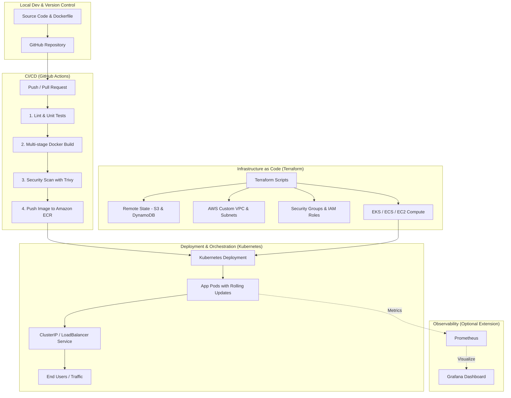

# Project Agent Plan: Cloud-Native DevOps & CI/CD Pipeline

## 🎯 Objective
Build a production-grade, portfolio-ready DevOps project from scratch for intern and fresher roles. This project bridges your current knowledge of **CI/CD, GitHub, and AWS** with industry-standard tools: **Docker**, **Terraform (IaC)**, and **Kubernetes**.

---

## 🏗️ Architecture & High-Level Flow

---

## 📋 Phased Execution Roadmap

### 📦 Phase 1: Application Setup & Containerization (Docker)
- **Goals:** 
  - Scaffold a lightweight microservice (Node.js / Express or Python / FastAPI) with database integration (PostgreSQL or Redis).
  - Understand Docker concepts: Images, Containers, Layers, Multi-stage builds.
- **Deliverables:**
  - `Dockerfile` (optimized multi-stage build, non-root user).
  - `.dockerignore` file.
  - `docker-compose.yml` (app + database local environment).

---

### ⚙️ Phase 2: Automated CI/CD Pipeline (GitHub Actions)
- **Goals:**
  - Automate testing, building, scanning, and container publishing.
- **Deliverables:**
  - `.github/workflows/ci-cd.yml` workflow.
  - Test and lint verification steps.
  - Image vulnerability scanning with **Trivy**.
  - Secure authentication to AWS via **OIDC / GitHub Secrets**.
  - Automated push to **Amazon ECR** (Elastic Container Registry).

---

### ☁️ Phase 3: Infrastructure as Code (Terraform)
- **Goals:**
  - Provision reproducible cloud infrastructure on AWS declaratively.
- **Deliverables:**
  - `terraform/` directory structure (`main.tf`, `variables.tf`, `outputs.tf`, `providers.tf`).
  - Remote backend configuration (AWS S3 + DynamoDB state locking).
  - Custom AWS VPC, Public/Private subnets, Internet Gateway, NAT Gateway, Route Tables.
  - Security Groups, IAM Roles/Policies, and target compute infrastructure.

---

### ☸️ Phase 4: Container Orchestration & Deployment (Kubernetes)
- **Goals:**
  - Learn Kubernetes fundamentals: Pods, Deployments, Services, ConfigMaps, Secrets, Ingress.
- **Deliverables:**
  - `k8s/` manifests:
    - `deployment.yaml` (replica sets, health checks, resource limits, rolling update strategy).
    - `service.yaml` (exposing the app via LoadBalancer/NodePort).
    - `configmap.yaml` & `secret.yaml` (environment configuration).
    - `ingress.yaml` (optional routing).
  - Continuous Deployment step in GitHub Actions or GitOps with ArgoCD (bonus).

---

### 📊 Phase 5: Observability & Documentation (Portfolio Polish)
- **Goals:**
  - Showcase real-world engineering practices and metrics.
- **Deliverables:**
  - Health check endpoints (`/healthz`, `/metrics`).
  - Basic Prometheus metrics scraping & Grafana dashboard config.
  - Comprehensive `README.md` containing architecture diagrams, local setup instructions, deployment guides, and interview talk tracks.

---

## 🛠️ Tooling & Tech Stack Summary

| Domain | Tools / Technologies |
|---|---|
| **Language & App** | Node.js (Express) or Python (FastAPI) |
| **Containerization** | Docker, Docker Compose |
| **CI/CD** | GitHub Actions |
| **Cloud Provider** | AWS (ECR, VPC, EC2/ECS/EKS, S3, IAM) |
| **IaC** | Terraform |
| **Orchestration** | Kubernetes (K3s / Minikube / EKS) |
| **Security & Scanning** | Trivy, Checkov / tfsec |
| **Monitoring (Bonus)** | Prometheus, Grafana |

---

## 🚀 Working Guidelines for the Agent & User
1. **Interactive Learning:** For every step, explain the fundamental "why" before writing configuration files.
2. **Best Practices First:** Implement security, least-privilege IAM, non-root containers, and cost-efficient AWS setups.
3. **Cost Awareness:** Always ensure AWS resources stay within Free Tier limits or are quickly destroyable with `terraform destroy`.

